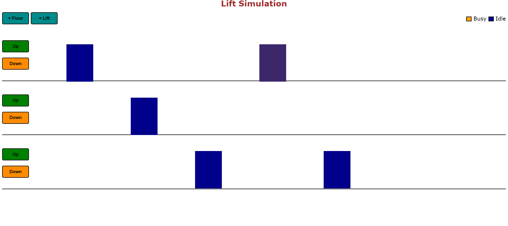

# Lift Simulation

# Features

1. A page where the user inputs the number of floors and lifts.
2. An interactive UI is generated, where we have visual depictons of lifts and buttons on floors
3. Upon clicking a particular button on the floor, a lift goes to that floor
